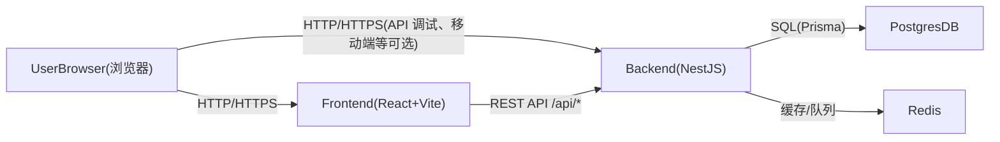

## 架构总览

- **前端**：React + Vite SPA，负责路由、状态管理和界面交互。
- **后端**：NestJS 单体应用，按功能模块拆分（auth、users、workspaces、tasks、knowledge 等）。
- **数据库**：PostgreSQL，使用 Prisma 作为 ORM 与迁移工具。
- **缓存与异步**：Redis（后续用于缓存、会话/黑名单、异步任务等）。
- **网关/入口**：开发阶段由 Vite dev server 和 NestJS 直连，生产阶段由 Nginx 统一反向代理。

## 模块划分

- `auth`：认证与令牌管理（注册、登录、刷新 token、密码重置）。
- `users`：用户基础信息与用户设置。
- `workspaces`：多租户边界与成员关系。
- `tasks`：任务、任务列表与看板视图。
- `knowledge`：文档、文档树与搜索。
- `files`：文件上传与访问控制。
- `audit`：审计日志。
- `analytics`：基础统计与简单报表。

后端代码将按 NestJS 的模块化方式组织，每个功能域一个模块，模块内再细分 controller/service/repository（Prisma 封装）等。

